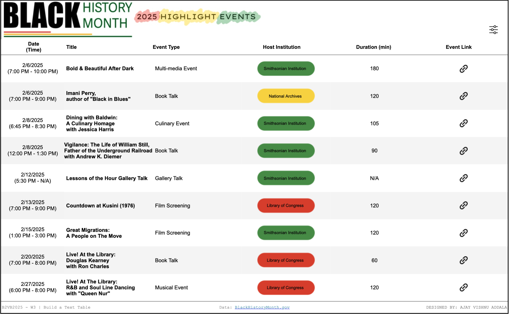

# Black History Month Event Highlights Dashboard

This Tableau dashboard was created for Week 3 of the 2025 #B2VB Challenge to celebrate Black History Month. It showcases the nine 2025 Event Highlights featured on BlackHistoryMonth.gov, honoring the achievements and contributions of Black leaders, innovators, and communities.

---

## Features

1. **Text Table Design**:
   - Columns for Date & Time, Title, Event Type, Host Institution, Duration, and Link.
   
2. **Interactive Hover Details**:
   - Hovering over a row displays the event cover image and description.

3. **Clickable Links**:
   - Clicking the link icon in the "Link" column redirects to the official event webpage for more information.

4. **Sort Options**:
   - Users can sort the table dynamically by:
     - **Sort By**: Date, Title, Event, Host Institution, or Duration.
     - **Order By**: Ascending or Descending.

---

## Screenshot

---

## Tableau Public Link

You can explore the dashboard here: [View Dashboard on Tableau Public](https://public.tableau.com/views/BlackHistoryMonthHighlightEventsTextTableB2VB2025W3/B2VB2025W3?:language=en-US&:sid=&:redirect=auth&:display_count=n&:origin=viz_share_link)

---

## About Black History Month

Black History Month honors the achievements, contributions, and lasting impact of Black leaders, innovators, and communities throughout history. Participating in events during this month provides an opportunity to deepen understanding and celebrate the rich cultural heritage of the Black community.

For more information, visit: [BlackHistoryMonth.gov](https://blackhistorymonth.gov/)

---

